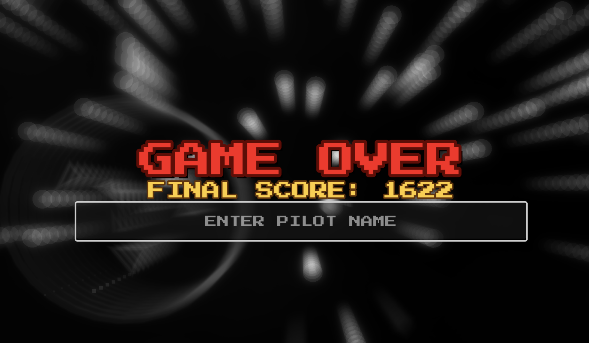

# SPACE23

[](https://fabriziosalmi.github.io/space23/)

A vertical shoot-'em-up that runs in your browser. Music-driven: the nebula, the camera, the wave pacing — all react to the bass, the mids, and the highs. No install, click the banner.



## Play

→ [fabriziosalmi.github.io/space23](https://fabriziosalmi.github.io/space23/)

WebAssembly + WebGL 2 build. Desktop and mobile browsers. First load fetches a few MB; cached afterwards.

## Controls

Desktop:

- Move: `WASD` / arrows, or hold left mouse to chase the cursor
- Fire: `Space` (held = autofire)
- Dash: `Shift`
- Smart bomb: `X`
- Pause: `Esc` / `P`

Mobile: tap-and-drag to move + autofire; on-screen `B` for the bomb.

## Highlights

- **Six tracks**, each one drives the palette of the procedural nebula and synchronises a screen warp + a burst of enemies on the drop. One boss per track.
- **Six enemy AIs** (scout, fighter, tank, spinner, invader, mothership) drawn from twelve wave shapes through a shuffled deck.
- **Four power-ups** — heal, railgun, drones, black hole. The black hole bends the screen via the same fragment shader that handles boss-kill lensing.
- **Time dilation tied to your movement**, SUPERHOT-style: stop and the world slows, dash and it snaps back.
- **Wave pacing coupled to the music**: build-up before the drop spaces enemies further apart, the drop force-spawns a barrage, post-drop gives a brief calm.
- **Procedural everything**: ship, trails, explosions, parallax, nebula are drawn from code/shaders. Only the planet/galaxy/nebula sprites that drift past as landmarks are images.

## Run locally

Requirements: [Godot 4.4](https://godotengine.org/download), [Git LFS](https://git-lfs.com).

```bash
git lfs install
git clone https://github.com/fabriziosalmi/space23.git
cd space23
# open project.godot in Godot, press F5
```

Layout:

- Top-level scripts: `Main.gd`, `Player.gd`, `AudioManager.gd`, `BackgroundRenderer.gd`, `UIManager.gd`.
- Subsystems in `systems/`: `EnemySystem`, `ProjectileSystem`, `WaveDirector`, `BlackHoleSystem`, `ExplosionSystem`, `PowerupSystem`, `RailgunSystem`, `PostFXController`.
- Fragment shaders in `shaders/`: nebula FBM, post-process pass (vignette, gravitational lensing, chromatic aberration, scanlines, zoom blur, grayscale), procedural flame, planet tinting.
- `waves.json` — wave patterns + per-wave modifiers (count, density, speed, colour).
- `default_bus_layout.tres` — audio bus layout (Master + spectrum analyzer effect). Required by Godot 4 web export.
- `*.ogg` — six music tracks (LFS).

Tweak points:

- Enemy stats and AI: `ENEMY_TYPES` and `_ai_*` routines in `systems/EnemySystem.gd`.
- Wave shapes: `waves.json` plus `WaveDirector._spawn_pattern`.
- Track palettes and drop times: `AudioManager.gd` `playlist` array.
- Post-process look: uniforms in `shaders/post.gdshader`.

## Tech

- Godot 4.4, Forward+ renderer, GDScript only, no plugins.
- HTML5 → WebAssembly + WebGL 2. CI under `.github/workflows/` runs the headless export and publishes to GitHub Pages.
- `AudioEffectSpectrumAnalyzer` on the Master bus (low / mid / high) feeds shader uniforms and gameplay timing.
- HDR pipeline: bloom + ACES tonemap. Stereo SFX panning via `AudioStreamPlayer2D` using the active `Camera2D` as listener.

## Credits

- **Music** composed and produced with Suno AI, using a custom v5.5 model fine-tuned on my own tracks. More of my music under the Space Invaders alias at [soundcloud.com/spaceinvaders](https://soundcloud.com/spaceinvaders).
- **Background imagery** (planets, galaxy, nebula, cluster, black hole): generated with Gemini's image model.
- **Code** written by Gemini and Claude under my orchestration.
- **Inspiration**: the original Space Invaders, and Space Invaders Tekno Sound — the freetekno collective I belong to. Hence the name.

## What's next

This is the first browser game I'm shipping on this skeleton (Godot 4 + GitHub Pages auto-deploy + audio-reactive scaffolding). If it lands, more will follow on the same template. Forks welcome.

## License

Code: see `LICENSE`. Music tracks released for use within this game; please ask before reusing them elsewhere.
